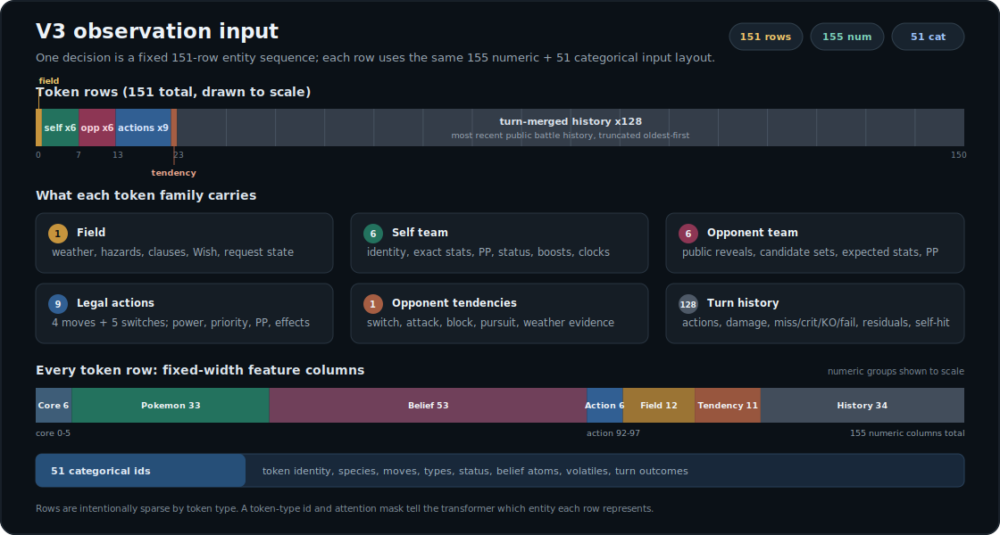

# PokeZero

PokeZero is a **work-in-progress** effort to train an agent that plays Pokémon Showdown **Gen 3
random battles** at a high level — **pure self-play reinforcement learning**, no human data, no
scripted teachers. The approach is AlphaZero-style: improve a policy/value network by having it
play itself, here applied to an imperfect-information, simultaneous-move game.

> ⚠️ Active research. Encodings, APIs, and checkpoints change frequently. The neural policy below
> is the current frontier; the linear baseline and parts of the harness are earlier scaffolding
> kept for reference. Checkpoints are pinned to observation-schema versions — see
> [`docs/model_versioning.md`](docs/model_versioning.md) before loading anything old.

## How it works

- **Observation — raw facts only.** The battle state is encoded as per-entity tokens, each carrying
  categorical ids plus numeric features. A **hard rule**: no precomputed type effectiveness, STAB,
  expected power, damage estimates, or matchup summaries — the model must learn these from raw
  observable facts.
- **Hidden information → belief.** A public belief engine tracks only what is observable about the
  opponent (revealed moves/ability/item, candidate sets narrowed against the public random-battle
  set data) instead of leaking hidden state.
- **Model.** An entity-token transformer **encoder** that outputs a policy over legal actions **and**
  a value estimate — AlphaZero-style policy+value, *not* autoregressive next-token prediction —
  plus auxiliary prediction heads (opponent action, action family, switch target) trained
  alongside. Gen 3 dex data is loaded generation-correctly via `Dex.forGen(3)`.
- **Test-time search.** A root-PUCT search layer (`pokezero.search_policy`) can sit on top of any
  checkpoint at play time: belief-backed world sampling (determinization), opponent-action
  scenarios, and a calibrated value leaf. In paired evaluation it beats the same checkpoint
  without search. See [`docs/test_time_search_plan_v2.md`](docs/test_time_search_plan_v2.md).

## What the model sees (v3)



V3 is the next training schema; its Python layout is frozen while the Rust mirror and fresh audit
artifacts are completed. One decision is **151 tokens**: a global field token (weather, hazards,
clauses, Wish, turn count, request kind), six self-team tokens (full knowledge: exact stats, PP,
status, boosts, public volatile clocks), six opponent tokens (public reveals plus belief candidates,
expected stats, and PP evidence), nine action-candidate tokens (the 4 moves and 5 switches the
policy chooses among), one opponent-tendency token, and **128 turn-merged history tokens**. History
lives in these tokens rather than stacked past frames. Every token carries **51 categorical ids**
(direct closed-vocabulary lookups into 841 embedding rows — no feature hashing) and **155 numeric
features**, grouped by semantic role. The exact layout is documented in
[`docs/observation_v3_spec.md`](docs/observation_v3_spec.md).

## Quickstart

Prerequisites: a **built** Pokémon Showdown checkout (so `dist/sim/index.js` exists), passed as
`--showdown-root` on each command, plus the `neural` extra (PyTorch):

```bash
pip install -e '.[neural]'   # or: uv sync --extra neural
```

Run self-play iterations (collect → train → benchmark each round). The cold start is
`random-legal` — iteration 1 trains on random self-play, and the network takes over from there:

```bash
python -m pokezero.neural_cli iterate --run-dir runs/selfplay --iterations 5 \
  --games-per-iteration 512 --evaluation-games 40 --initial-policy random-legal \
  --showdown-root /path/to/pokemon-showdown
```

Benchmark a checkpoint against the fixed baselines:

```bash
python -m pokezero.neural_cli benchmark --checkpoint runs/selfplay/iteration-0005/transformer-policy.pt \
  --games 50 --showdown-root /path/to/pokemon-showdown
```

Play a checkpoint with root-PUCT search against FoulPlay, paired against the raw policy on the
same seeds:

```bash
python scripts/compare_root_puct_vs_foulplay.py --checkpoint <policy.pt> \
  --root-extra-visits 120 \
  --search-time-ms 100 --comparison-mode per-seed --games 50 \
  --showdown-root /path/to/pokemon-showdown \
  --foulplay-root /abs/path/to/third_party/foul-play \
  --foulplay-python /abs/path/to/third_party/foul-play/.venv/bin/python
```

`--value-checkpoint <calibrated-leaf.pt>` optionally swaps in a calibrated copy of the value
head for leaf evaluation (see `pokezero.value_calibration`); omitted, search prices leaves with
the checkpoint's raw value head.

## Public Prior/Belief Profile

Capture a `pokezero.public-decision-corpus.v1` sidecar from controlled raw-policy FoulPlay games.
The sidecar retains only the acting player's encoded observation/history and legal mask, public
resolved action rounds, and public belief view. It never serializes opponent observations, request
payloads, opponent legal masks, or opponent request-local action indexes/slot order. Resolved
historical actions are public move IDs, switched species, or public event IDs and are resolved only
inside a sampled belief world. Capture another non-overlapping seed band with
`--append-public-decision-corpus` until the corpus has at least 2,000 valid `p1` decisions:

```bash
pokezero-foulplay-capture --checkpoint runs/selfplay/iteration-0005/transformer-policy.pt --out runs/foulplay-band-001.jsonl \
  --public-decision-corpus-out runs/public-decisions.jsonl --games 128 \
  --showdown-root /path/to/pokemon-showdown

pokezero-foulplay-capture --checkpoint runs/selfplay/iteration-0005/transformer-policy.pt --out runs/foulplay-band-002.jsonl \
  --public-decision-corpus-out runs/public-decisions.jsonl --append-public-decision-corpus \
  --games 128 --seed-start 129 --showdown-root /path/to/pokemon-showdown
```

Profile raw, untempered checkpoint priors and public-belief worlds. The command skips and records
individual prefixes that cannot replay publicly, requires at least 2,000 successfully profiled
decisions, rejects privileged opponent-mask mode, disables root noise, and records checkpoint,
corpus, schema, and configuration hashes in the report:

```bash
pokezero-neural prior-belief-profile --corpus runs/public-decisions.jsonl \
  --checkpoint runs/selfplay/iteration-0005/transformer-policy.pt --showdown-root /path/to/pokemon-showdown \
  --out runs/prior-belief-profile.json
```

## Components & docs

- **Self-play environment** — `pokezero.local_showdown`: a Node BattleStream-backed Gen 3 env;
  observations are built incrementally from the protocol stream.
- **Opponents & baselines** — `random-legal`, `simple-legal`, `max-damage` /
  `aggressive-damage` (fixed evaluation ladders), and **FoulPlay**
  (`third_party/foul-play` + `pokezero.foulplay_bridge`) as the external benchmark opponent.
  See [`docs/eval_opponents.md`](docs/eval_opponents.md).
- **Test-time search** — `pokezero.search_policy`, `pokezero.determinization`,
  `scripts/compare_root_puct_vs_foulplay.py`: root-PUCT over the policy's priors with
  belief-sampled worlds and a calibrated value leaf; paired-seed strength comparison built in.
- **Analysis** — behavioral trait tracking
  ([`docs/checkpoint_trait_tracking_plan.md`](docs/checkpoint_trait_tracking_plan.md)),
  strategy-diversity fingerprints
  ([`docs/diversity_fingerprint_plan.md`](docs/diversity_fingerprint_plan.md)), and their
  findings docs.
- **Belief sidecar** — `pokezero.sidecar`: a read-only webview of the public belief state for a live
  battle room.
- **Legacy scaffolding** — `pokezero.linear_cli` (the original dependency-free masked-softmax
  policy) and the early bootstrap/promotion harnesses; superseded by the neural self-play loop,
  kept for plumbing and debugging.
- **Design & background** — [`docs/`](docs/): `goals.md`, `model_versioning.md`,
  `mcts_design.md`, `test_time_search_plan_v2.md` (and the closed v1 with its disposition
  record), `human_predictor_plan.md`, the `foundation_*_results.md` series,
  `learning_architecture_exploration.md`, `observation_input_shape.html`.
