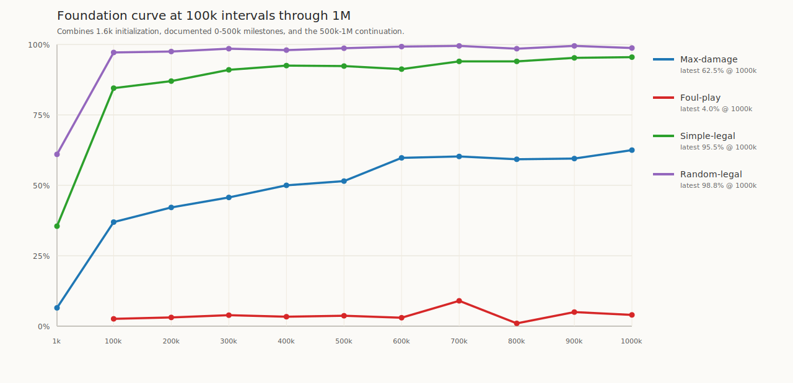
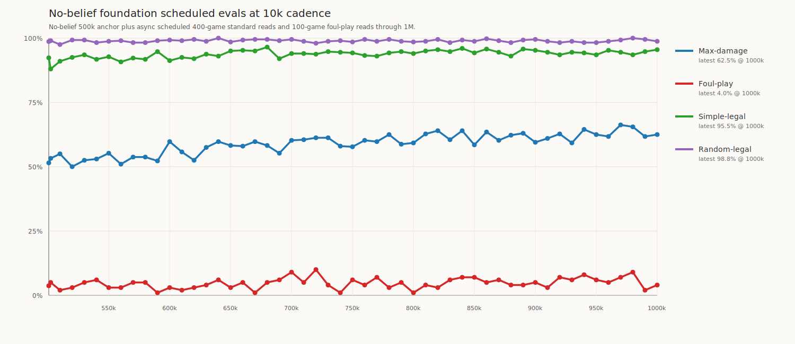
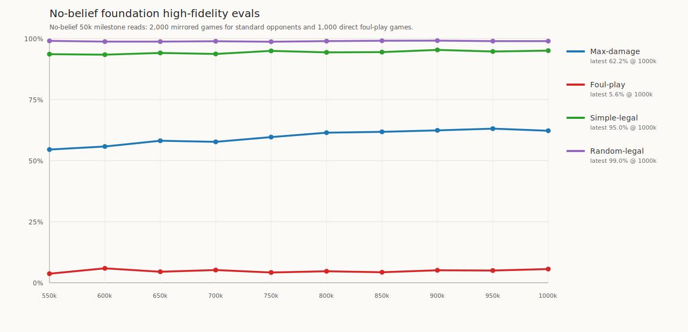

# Foundation 1M continuation progress

Status: final progress record for the recipe-fidelity continuation from the completed
**500,800-game** foundation checkpoint toward **1,000,000 self-play games**.

This note records evaluation evidence only. It intentionally omits private operational details.

## Evaluation cadence

- The 500k anchor row comes from [`foundation_500k_results.md`](foundation_500k_results.md).
- The MIT recipe and UT Austin transformer/input inspirations are documented in
  [`foundation_500k_results.md`](foundation_500k_results.md#source-papers).
- Continuation rows use the active 1M run's scheduled readouts.
- Continuation non-foul-play opponents are mirrored **400-game** aggregate reads.
- Continuation foul-play is a **100-game** async read at the same scheduled milestone.
- Larger independent 1,000-game reads are recorded below for 50k milestones.

## Plot Artifacts

The first plot summarizes the full foundation trajectory at coarse 100k intervals starting from the
first 1,600-game checkpoint. The second plot shows the continuation's lower-fidelity scheduled 10k
readouts; the table below preserves the exact data. The third plot shows the independent
high-fidelity 50k milestone reads.

## Standard 10k Progress

| Total self-play games | Checkpoint | Random-legal | Simple-legal | Max-damage | Foul-play |
|---:|---|---:|---:|---:|---:|
| 500,800 | 500k anchor, iteration 313 | 592 / 600 (98.7%) | 554 / 600 (92.3%) | 309 / 600 (51.5%) | 37 / 1000 (3.7%) |
| 502,400 | continuation iteration 1 | 396 / 400 (99.0%) | 352 / 400 (88.0%) | 213 / 400 (53.2%) | 5 / 100 (5.0%) |
| 510,400 | continuation iteration 6 | 390 / 400 (97.5%) | 364 / 400 (91.0%) | 220 / 400 (55.0%) | 2 / 100 (2.0%) |
| 520,000 | continuation iteration 12 | 397 / 400 (99.2%) | 370 / 400 (92.5%) | 200 / 400 (50.0%) | 3 / 100 (3.0%) |
| 531,200 | continuation iteration 19 | 397 / 400 (99.2%) | 374 / 400 (93.5%) | 210 / 400 (52.5%) | 5 / 100 (5.0%) |
| 540,800 | continuation iteration 25 | 393 / 400 (98.2%) | 367 / 400 (91.8%) | 212 / 400 (53.0%) | 6 / 100 (6.0%) |
| 550,400 | continuation iteration 31 | 395 / 400 (98.8%) | 371 / 400 (92.8%) | 221 / 400 (55.2%) | 3 / 100 (3.0%) |
| 560,000 | continuation iteration 37 | 396 / 400 (99.0%) | 363 / 400 (90.8%) | 204 / 400 (51.0%) | 3 / 100 (3.0%) |
| 571,200 | continuation iteration 44 | 393 / 400 (98.2%) | 369 / 400 (92.2%) | 215 / 400 (53.8%) | 5 / 100 (5.0%) |
| 580,800 | continuation iteration 50 | 393 / 400 (98.2%) | 367 / 400 (91.8%) | 215 / 400 (53.8%) | 5 / 100 (5.0%) |
| 590,400 | continuation iteration 56 | 396 / 400 (99.0%) | 379 / 400 (94.8%) | 209 / 400 (52.2%) | 1 / 100 (1.0%) |
| 600,000 | continuation iteration 62 | 397 / 400 (99.2%) | 365 / 400 (91.2%) | 239 / 400 (59.8%) | 3 / 100 (3.0%) |
| 611,200 | continuation iteration 69 | 396 / 400 (99.0%) | 370 / 400 (92.5%) | 223 / 400 (55.8%) | 2 / 100 (2.0%) |
| 620,800 | continuation iteration 75 | 398 / 400 (99.5%) | 368 / 400 (92.0%) | 210 / 400 (52.5%) | 3 / 100 (3.0%) |
| 630,400 | continuation iteration 81 | 395 / 400 (98.8%) | 375 / 400 (93.8%) | 230 / 400 (57.5%) | 4 / 100 (4.0%) |
| 640,000 | continuation iteration 87 | 400 / 400 (100.0%) | 372 / 400 (93.0%) | 239 / 400 (59.8%) | 6 / 100 (6.0%) |
| 651,200 | continuation iteration 94 | 394 / 400 (98.5%) | 380 / 400 (95.0%) | 233 / 400 (58.2%) | 3 / 100 (3.0%) |
| 660,800 | continuation iteration 100 | 397 / 400 (99.2%) | 381 / 400 (95.2%) | 232 / 400 (58.0%) | 5 / 100 (5.0%) |
| 670,400 | continuation iteration 106 | 398 / 400 (99.5%) | 380 / 400 (95.0%) | 239 / 400 (59.8%) | 1 / 100 (1.0%) |
| 680,000 | continuation iteration 112 | 398 / 400 (99.5%) | 386 / 400 (96.5%) | 233 / 400 (58.2%) | 5 / 100 (5.0%) |
| 691,200 | continuation iteration 119 | 396 / 400 (99.0%) | 368 / 400 (92.0%) | 221 / 400 (55.2%) | 6 / 100 (6.0%) |
| 700,800 | continuation iteration 125 | 398 / 400 (99.5%) | 376 / 400 (94.0%) | 241 / 400 (60.2%) | 9 / 100 (9.0%) |
| 710,400 | continuation iteration 131 | 395 / 400 (98.8%) | 376 / 400 (94.0%) | 242 / 400 (60.5%) | 5 / 100 (5.0%) |
| 720,000 | continuation iteration 137 | 392 / 400 (98.0%) | 375 / 400 (93.8%) | 245 / 400 (61.2%) | 10 / 100 (10.0%) |
| 731,200 | continuation iteration 144 | 395 / 400 (98.8%) | 379 / 400 (94.8%) | 245 / 400 (61.2%) | 4 / 100 (4.0%) |
| 740,800 | continuation iteration 150 | 396 / 400 (99.0%) | 378 / 400 (94.5%) | 232 / 400 (58.0%) | 1 / 100 (1.0%) |
| 750,400 | continuation iteration 156 | 394 / 400 (98.5%) | 377 / 400 (94.2%) | 231 / 400 (57.8%) | 6 / 100 (6.0%) |
| 760,000 | continuation iteration 162 | 398 / 400 (99.5%) | 373 / 400 (93.2%) | 241 / 400 (60.2%) | 4 / 100 (4.0%) |
| 771,200 | continuation iteration 169 | 395 / 400 (98.8%) | 372 / 400 (93.0%) | 239 / 400 (59.8%) | 7 / 100 (7.0%) |
| 780,800 | continuation iteration 175 | 398 / 400 (99.5%) | 377 / 400 (94.2%) | 250 / 400 (62.5%) | 3 / 100 (3.0%) |
| 790,400 | continuation iteration 181 | 395 / 400 (98.8%) | 379 / 400 (94.8%) | 235 / 400 (58.8%) | 5 / 100 (5.0%) |
| 800,000 | continuation iteration 187 | 394 / 400 (98.5%) | 376 / 400 (94.0%) | 237 / 400 (59.2%) | 1 / 100 (1.0%) |
| 811,200 | continuation iteration 194 | 395 / 400 (98.8%) | 380 / 400 (95.0%) | 251 / 400 (62.7%) | 4 / 100 (4.0%) |
| 820,800 | continuation iteration 200 | 398 / 400 (99.5%) | 382 / 400 (95.5%) | 256 / 400 (64.0%) | 3 / 100 (3.0%) |
| 830,400 | continuation iteration 206 | 393 / 400 (98.2%) | 379 / 400 (94.8%) | 242 / 400 (60.5%) | 6 / 100 (6.0%) |
| 840,000 | continuation iteration 212 | 397 / 400 (99.2%) | 384 / 400 (96.0%) | 256 / 400 (64.0%) | 7 / 100 (7.0%) |
| 851,200 | continuation iteration 219 | 395 / 400 (98.8%) | 377 / 400 (94.2%) | 234 / 400 (58.5%) | 7 / 100 (7.0%) |
| 860,800 | continuation iteration 225 | 399 / 400 (99.8%) | 383 / 400 (95.8%) | 254 / 400 (63.5%) | 5 / 100 (5.0%) |
| 870,400 | continuation iteration 231 | 396 / 400 (99.0%) | 378 / 400 (94.5%) | 241 / 400 (60.2%) | 6 / 100 (6.0%) |
| 880,000 | continuation iteration 237 | 393 / 400 (98.2%) | 372 / 400 (93.0%) | 249 / 400 (62.2%) | 4 / 100 (4.0%) |
| 891,200 | continuation iteration 244 | 397 / 400 (99.2%) | 383 / 400 (95.8%) | 252 / 400 (63.0%) | 4 / 100 (4.0%) |
| 900,800 | continuation iteration 250 | 398 / 400 (99.5%) | 381 / 400 (95.2%) | 238 / 400 (59.5%) | 5 / 100 (5.0%) |
| 910,400 | continuation iteration 256 | 395 / 400 (98.8%) | 378 / 400 (94.5%) | 244 / 400 (61.0%) | 3 / 100 (3.0%) |
| 920,000 | continuation iteration 262 | 393 / 400 (98.2%) | 374 / 400 (93.5%) | 251 / 400 (62.7%) | 7 / 100 (7.0%) |
| 931,200 | continuation iteration 269 | 395 / 400 (98.8%) | 378 / 400 (94.5%) | 237 / 400 (59.2%) | 6 / 100 (6.0%) |
| 940,800 | continuation iteration 275 | 393 / 400 (98.2%) | 377 / 400 (94.2%) | 258 / 400 (64.5%) | 8 / 100 (8.0%) |
| 950,400 | continuation iteration 281 | 393 / 400 (98.2%) | 374 / 400 (93.5%) | 250 / 400 (62.5%) | 6 / 100 (6.0%) |
| 960,000 | continuation iteration 287 | 395 / 400 (98.8%) | 381 / 400 (95.2%) | 247 / 400 (61.8%) | 5 / 100 (5.0%) |
| 971,200 | continuation iteration 294 | 397 / 400 (99.2%) | 378 / 400 (94.5%) | 265 / 400 (66.2%) | 7 / 100 (7.0%) |
| 980,800 | continuation iteration 300 | 400 / 400 (100.0%) | 374 / 400 (93.5%) | 262 / 400 (65.5%) | 9 / 100 (9.0%) |
| 990,400 | continuation iteration 306 | 398 / 400 (99.5%) | 379 / 400 (94.8%) | 247 / 400 (61.8%) | 2 / 100 (2.0%) |
| 1,000,000 | continuation iteration 312 | 395 / 400 (98.8%) | 382 / 400 (95.5%) | 250 / 400 (62.5%) | 4 / 100 (4.0%) |

The 502,400 row is the first checkpoint after resuming from the 500,800-game model. It is useful as
an initial continuation baseline, but it is closer to a startup read than a regular 10k interval.
The foul-play anchor is a higher-fidelity 1,000-game read; continuation foul-play rows are the
scheduled 100-game milestone reads.

## High-Fidelity 50k Progress

Continuation high-fidelity rows use independent **1,000-game-per-seat mirrored** reads for
random/simple/max-damage, for 2,000 aggregate games per matchup, and an independent **1,000-game**
foul-play read. Rows are added only once all four opponents have complete results, so partial
milestones are not mixed into the trend table.

| Total self-play games | Checkpoint | Random-legal | Simple-legal | Max-damage | Foul-play |
|---:|---|---:|---:|---:|---:|
| 550,400 | continuation iteration 31 | 1,981 / 2,000 (99.1%) | 1,872 / 2,000 (93.6%) | 1,091 / 2,000 (54.5%) | 37 / 1,000 (3.7%) |
| 600,000 | continuation iteration 62 | 1,975 / 2,000 (98.8%) | 1,868 / 2,000 (93.4%) | 1,116 / 2,000 (55.8%) | 59 / 1,000 (5.9%) |
| 650,000 | continuation iteration 94 | 1,975 / 2,000 (98.8%) | 1,882 / 2,000 (94.1%) | 1,163 / 2,000 (58.1%) | 45 / 1,000 (4.5%) |
| 700,000 | continuation iteration 125 | 1,970 / 2,000 (98.5%) | 1,879 / 2,000 (94.0%) | 1,154 / 2,000 (57.7%) | 52 / 1,000 (5.2%) |
| 750,400 | continuation iteration 156 | 1,974 / 2,000 (98.7%) | 1,899 / 2,000 (95.0%) | 1,193 / 2,000 (59.7%) | 42 / 1,000 (4.2%) |
| 800,000 | continuation iteration 187 | 1,979 / 2,000 (99.0%) | 1,887 / 2,000 (94.3%) | 1,229 / 2,000 (61.5%) | 47 / 1,000 (4.7%) |
| 850,000 | continuation iteration 219 | 1,982 / 2,000 (99.1%) | 1,889 / 2,000 (94.4%) | 1,236 / 2,000 (61.8%) | 43 / 1,000 (4.3%) |
| 900,000 | continuation iteration 250 | 1,983 / 2,000 (99.2%) | 1,907 / 2,000 (95.4%) | 1,248 / 2,000 (62.4%) | 51 / 1,000 (5.1%) |
| 950,000 | continuation iteration 281 | 1,979 / 2,000 (99.0%) | 1,894 / 2,000 (94.7%) | 1,262 / 2,000 (63.1%) | 50 / 1,000 (5.0%) |
| 1,000,000 | continuation iteration 312 | 1,979 / 2,000 (99.0%) | 1,901 / 2,000 (95.0%) | 1,245 / 2,000 (62.2%) | 56 / 1,000 (5.6%) |

## Final Readout

The 500k-to-1M continuation is constructive for the current recipe. The 500k anchor was 309 / 600
(51.5%) against max-damage, while the final scheduled 1M read was 250 / 400 (62.5%). Scheduled
10k reads are noisy, but the continuation spent most of the later run in a high-50s to mid-60s
max-damage band, with a peak scheduled read of 265 / 400 (66.2%) at the 970k threshold.

The cleaner 50k high-fidelity series shows the same shape. Max-damage moved from 1,091 / 2,000
(54.5%) at 550k to 1,245 / 2,000 (62.2%) at 1M, with the best high-fidelity row at 950k:
1,262 / 2,000 (63.1%). Random-legal and simple-legal remained saturated by the end of the run:
1,979 / 2,000 (99.0%) against random-legal and 1,901 / 2,000 (95.0%) against simple-legal.

Foul-play remains the harder downstream bar, but it did not collapse. The 1M high-fidelity foul-play
read finished at 56 / 1,000 (5.6%), compared with 37 / 1,000 (3.7%) at the 500k anchor and 37 / 1,000
(3.7%) at 550k. This is still low in absolute terms, which is expected against a stronger benchmark
bot, but it is compatible with the hypothesis that foul-play is a lagging high-bar readout while
max-damage captures earlier learning progress.

The practical interpretation is that this recipe has not obviously exhausted itself by 1M games.
The strongest signal is the sustained improvement against max-damage. The next recipe decision should
therefore be made from a larger-scale continuation or an explicit recipe-change experiment, not from
the low absolute foul-play score alone.

Known caveat: foul-play high-fidelity probes required retries around a third-party Rest/sleep
state-tracking crash. The recorded win counts are completed games only, but abandoned crashed games
are not neutral samples, so foul-play should be treated as useful directional evidence until that
opponent crash is fixed.
