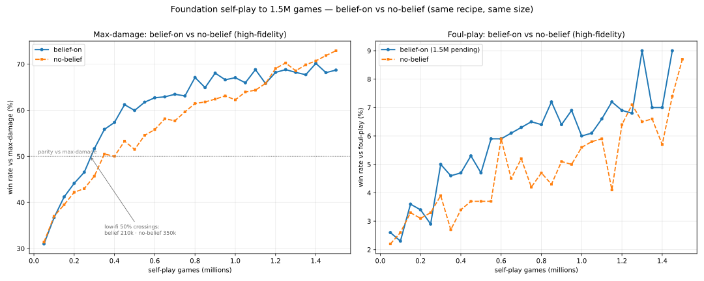

# Belief-on foundation 1.5M run results

Status: current evidence from the completed recipe-fidelity **belief-on** foundation run that
trained from scratch to **1,500,800 self-play games** on July 2, 2026.

This note records evaluation evidence only. It intentionally omits private operational details.

This is the first foundation run trained with a **working belief-input path**. It is the fixed-belief
counterpart the no-belief baseline was set aside for comparison against — see
[`no_belief_foundation_baseline.md`](no_belief_foundation_baseline.md). Compare this run against the
`pokezero-no-belief-*` family; do not merge the two into one curve.

## What belief-on means

Unlike the `pokezero-no-belief-*` family, this run's policy received the belief-derived opponent
features on every step:

- candidate opponent movesets inferred from the Gen 3 randbat universe (revealed + still-possible),
- possible opponent items and abilities,
- hidden-set branches that remain consistent with the public evidence, with an uncertainty signal.

The belief path was fixed and wired into the RL observation before this run started (revealed-move
encoding, item/ability reveal parsing, candidate-set summarization with graceful drift/Transform
handling). The observation tensor shape is unchanged from the no-belief family; the previously-zeroed
belief slots now carry real signal.

## Run shape

- **Training games:** 1,500,800 (from scratch, no parent checkpoint).
- **Update cadence:** 1,600 games per PPO update.
- **Final iteration:** 938.
- **Belief inputs:** enabled (candidate-set source on).
- **Training device:** GPU for the central PPO train step; CPU-parallel battle collection.
- **Evaluation cadence:** low-fidelity yardstick reads at 10k-game thresholds (600 games/opponent,
  100 foul-play), plus independent high-fidelity reads at 50k milestones (2,000 mirrored games per
  standard matchup, 1,000 direct foul-play games).

## High-fidelity evals at 1.5M

Standard high-fidelity opponents use 2,000 mirrored games per matchup; foul-play uses 1,000 direct
games. The 1.5M standard read is complete; the 1.5M high-fidelity foul-play read is in progress, so
the foul-play cell below cites the most recent completed high-fidelity foul-play read (1.4M).

| Run | Random-legal | Simple-legal | Max-damage | Foul-play | Source |
|---|---:|---:|---:|---:|---|
| belief-on 1.5M (this run) | 1984 / 2000 (99.2%) | 1937 / 2000 (96.9%) | 1374 / 2000 (68.7%) | 90 / 1000 (9.0%, @1.45M) | High-fidelity |
| no-belief 1.5M (baseline) | 1990 / 2000 (99.5%) | 1925 / 2000 (96.2%) | 1458 / 2000 (72.9%) | 87 / 1000 (8.7%) | High-fidelity |

On the standard opponents the two families land within read-to-read noise of each other at 1.5M
(belief slightly higher vs simple-legal, slightly lower vs max-damage). Foul-play stays in single
digits for both — the searchless-policy ceiling against a search-based opponent has not been broken
by 1.5M — but the belief-on run holds a small, fairly consistent edge across most of the run (see the
comparison chart), ending comparable to the no-belief baseline (9.0% @1.45M vs 8.7% @1.5M).

## Where belief actually helped: earlier skill acquisition

The distinguishing effect at this scale is **how quickly** the belief-on run climbed, not where it
finished. Low-fidelity max-damage win rate first crossed parity (50%) at very different points:

| Milestone to reach 50% vs max-damage | Games |
|---|---:|
| belief-on run | **210,000** |
| no-belief baseline | 350,000 |

The belief-on run reached max-damage parity roughly **40% sooner in games**. Belief-on low-fidelity
trajectory (600-game max-damage, 100-game foul-play):

| Games | Max-damage | Foul-play | Simple-legal |
|---:|---:|---:|---:|
| 100k | 36.0% | 2% | 86.0% |
| 200k | 45.5% | 4% | 90.5% |
| 300k | 52.0% | 5% | 93.0% |
| 500k | 63.2% | 3% | 95.3% |
| 750k | 64.0% | 13% | 95.7% |
| 1.0M | 68.7% | 5% | 96.7% |
| 1.25M | 69.8% | 9% | 98.3% |
| 1.48M | 72.7% | 5% | 97.3% |

Interpretation: the belief features front-loaded learning against pressure-based opponents, then the
two families converged to comparable strength on these yardsticks by 1.5M. Whether belief translates
into a durable foul-play advantage is not yet distinguishable at 1.5M — which motivates the
**1.5M → 3M continuation** now running.

## Behavioral fingerprints

Two checkpoint-side probes now record how behavior evolves across milestones (see
`scripts/collapse_probe.py` and `scripts/behavior_probe.py`):

- **collapse signals** — policy entropy / perplexity / near-deterministic rate (mode collapse), setup
  usage over healthy states (myopic collapse), plus run-side game length + tie rate (stall collapse).
- **behavioral fingerprint** — move-usage distribution over the policy's own self-play games, and
  **pivot rate** (voluntary switch-outs before a faint vs. KO-forced replacements).

From the 1.5M → 3M continuation onward these are recorded per high-fidelity milestone and surfaced in
the run's progress reporting, so move-preference drift and pivoting can be watched over training.

## Comparison chart

Same-size (1.5M), same-recipe high-fidelity comparison of the belief-on run against the no-belief
baseline:

Reading the chart:

- **Max-damage (left):** belief-on sits clearly above no-belief through ~1.2M games — roughly a
  5–8 point lead across the 300k–500k band — then the two converge and no-belief edges slightly ahead
  in the final 1.3–1.5M stretch. The belief signal front-loaded skill acquisition rather than raising
  the ceiling.
- **Foul-play (right):** belief-on holds a small, fairly consistent edge for most of the run, ending
  comparable to the no-belief baseline.

Fidelity caveat: no-belief's 50k–500k points are the 500k run's high-fidelity / standard yardstick
reads (that run predates the append-only eval timeline); 550k–1.5M is from the run index. Belief-on
is the run index across the whole range. The belief-on 1.5M foul-play high-fidelity read was still
in progress at authoring time, so the foul-play curve ends at its 1.45M read.
