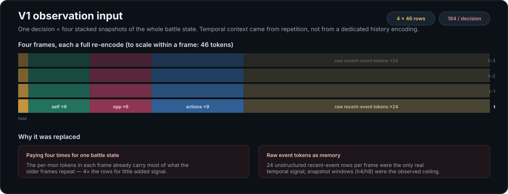
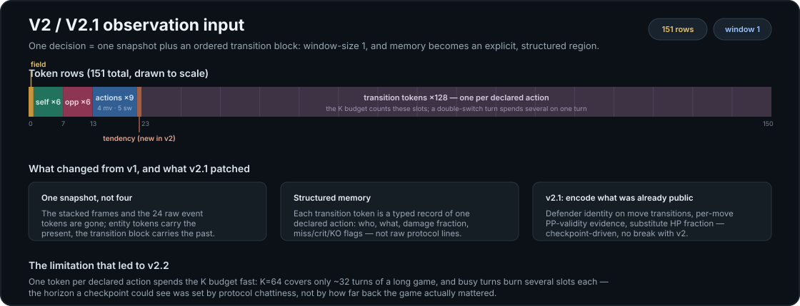
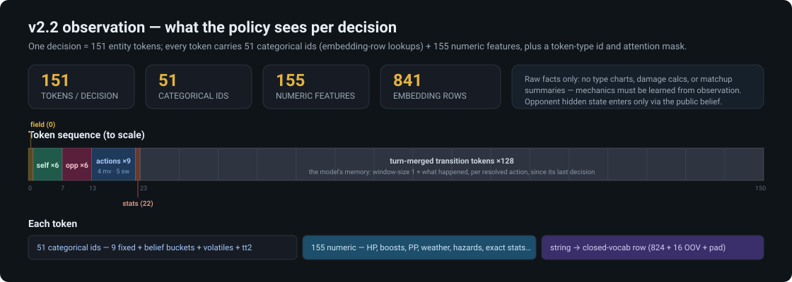
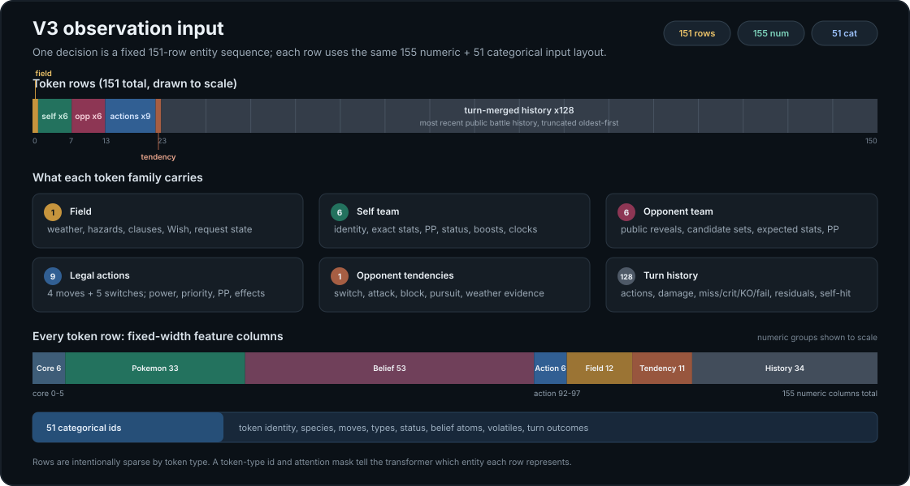
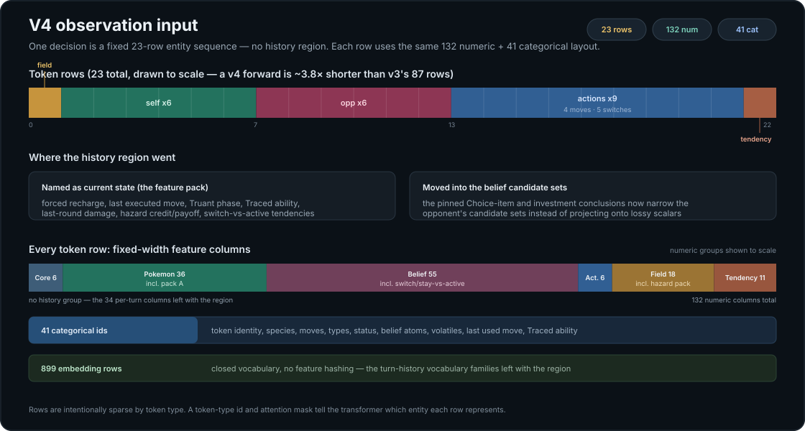

# How the observation evolved: v1 → v4

The observation schema is the model's entire sensory world, and it has been rebuilt four times.
Each version below exists because a specific limitation of the previous one was measured — not
suspected — and each section states what that version was, what broke or underperformed, and what
the next version did about it. Two rules have held through every revision:

1. **Raw facts only.** No precomputed type effectiveness, STAB, expected damage, or matchup
   summaries. If the model wants a type chart, it has to learn one.
2. **Hidden information enters only through the public belief.** What the opponent has not revealed
   reaches the model as candidate sets and uncertainty derived from public reveals — never as
   privileged simulator state.

Checkpoints are pinned to schema versions (see [`model_versioning.md`](model_versioning.md));
every version below v4 remains loadable and byte-identical for its own checkpoints, except v1,
which is refuse-on-load.

| | tokens / decision | numeric | categorical | memory mechanism |
|---|---|---|---|---|
| v1 | 4 × 46 = 184 | — | — | four stacked full snapshots + 24 raw event tokens each |
| v2 / v2.1 | 151 | — | — | one snapshot + 128 per-action transition tokens |
| v2.2 | 151 | 155 | 51 | one snapshot + 128 turn-merged transition tokens |
| v3 | 87 | 155 | 51 | 64 turn-merged history rows, grouped public layout |
| **v4** | **23** | **132** | **41** | **none — nine facts named as current state instead** |

---

## v1 — stacked snapshots

The original neural encoding: `window_size=4` complete copies of the battle state, stacked. Each
frame carried one field token, six self-team tokens, six opponent tokens, nine action candidates,
and **24 raw recent-event tokens** — 46 rows per frame, 184 per decision.

The shape was modeled on [Metamon](https://metamon.tech/)'s input design — prior art for
observation and evaluation ideas here, though PokeZero owns its implementation and trains from
pure self-play. In practice it proved quite wasteful of input space: most of every decision's
rows re-stated facts the model had already been shown, and the versions that follow are largely
the history of reclaiming that space.

**The limitation.** The per-mon tokens in each frame already encode most of what the older frames
repeat, so the model paid four times for one battle state, with much of the genuinely temporal
signal riding on the unstructured event rows. Deeper windows did help — h8 held a consistent edge
over h4 — but each extra frame cost a full re-encode, and coverage was hard-capped at the window:
anything older than the last few turns was simply invisible. The full analysis is
[`observation_compression_design.md`](observation_compression_design.md), whose conclusion is that
an ordered transition region can extend memory to effectively the whole game where snapshot
windows were the ceiling.

**Addressed in v2** by inverting the design: encode the present once, and make memory an explicit,
structured region instead of a side effect of repetition. v1 was a one-way break — v1 checkpoints
refuse to load and replay only from their pinned tag.

## v2 / v2.1 — one snapshot plus a transition block

`window_size=1`. The stacked frames and raw event tokens are gone; in their place, one
opponent-tendency token and a **128-slot transition block** — one typed token per *declared
action*: who acted, what they did, damage fraction, miss/crit/KO flags. The `K` budget counts these
slots.

**v2.1** (checkpoint-driven, no break): three facts that were public all along but never encoded —
defender identity on move transitions, per-move PP-validity evidence, and substitute HP fraction.
An early instance of a pattern that recurs through this history: *the world already knew it; the
observation just wasn't carrying it.*

**The limitation.** One token per declared action means protocol chattiness sets the horizon.
K=64 covers only ~32 turns, and a busy turn (switch, replacement, multiple declarations) burns
several slots on one turn. The model's effective memory depended on how noisy the game was, not on
how far back it mattered.

**Addressed in v2.2** by changing what one slot means.

## v2.2 — turn-merged transitions

Same 151-token sequence, but each transition token now covers a **whole turn/lead/replacement
phase**, with two ordered sub-blocks so speed order stays explicit and negated declarations stay
representable. `K` still counts tokens, so an unchanged budget roughly **doubles the temporal
horizon**. Every v2/v2.1 checkpoint kept scoring byte-identically; fresh training stamped v2.2.

**The limitation** was no longer the mechanism but the layout and the payload. Columns had accreted
chronologically rather than semantically; fourteen fields were provably unreachable in the gen 3
random-battle pool (documented case by case in
[`dead_observation_fields.md`](dead_observation_fields.md)); and the private writer surface doubled
as the public contract, so every consumer was coupled to encoder internals.

**Addressed in v3** with a grouped public layout, audited column by column.

## v3 — the grouped public layout

One decision is **87 rows**: a field token, six self, six opponent, nine actions, one tendency
token, and a **64-row turn-merged history tail**. Every row carries **155 numeric** features in
semantic groups (core / pokemon / belief / action / field / tendency / history) and **51
categorical ids** resolved against a closed vocabulary — no feature hashing. The fourteen
unreachable fields are dropped from the public tensor, and the public layout is decoupled from the
private writer surface. Full column map in [`observation_v3_spec.md`](observation_v3_spec.md).

**The limitation.** v3 made history *cheap enough to sweep*, and the sweep is what retired it.
Five 10M-game arms differing only in history budget (`transition_token_budget` = k) were trained
and evaluated under pooled high-fidelity FoulPlay: the ordering came back **k1 > k0 > k8 > k64**,
and history was also the instability axis — the k64 arm entered runaway dilution→sharpening cycles
and collapsed while the low-k arms traversed the same schedule clean. A single history row beat
everything, which raises the obvious question: *what is that one row actually carrying?* Meanwhile
the region itself cost 64 of 87 rows — most of every forward pass spent on the axis that helped
least — and the two pinned Tier-2 columns projected rich belief conclusions onto lossy scalars.

**Addressed in v4** by answering the question directly.

## v4 — no history region; sufficient statistics instead

**23 rows. The history region is removed, not masked** — the 64 transition rows, the 34-column
history numeric group, and the turn-history vocabulary families are gone from the contract
entirely (embedding table 899 rows). Every forward is ~3.8× shorter, there is no history budget
left to mis-set, and a v4 checkpoint cannot be fed synthesized history because there is nowhere to
put it.

What the k1 row was carrying is **named as current state** — the feature pack:

- **Per-mon (pack A):** opponent forced recharge, per-side last executed move, Truant loaf phase,
  the currently Traced ability, last-round damage dealt/taken, Choice lock, item swapped.
- **Field (pack B):** entry-hazard credit and expected value per side, items-removed credit.
- **Belief:** matchup-conditional switch/stay tendencies beside the marginal ones.

The design reading of the sweep: k1 winning meant *prior-turn information and longer trends
matter* — but not enough to deserve 64 of 87 rows. So v4 encodes what that history was providing
while investing almost no input space in it: the recent-turn facts and longer-horizon trends
arrive as a handful of named columns on tokens the model already attends to, keeping the
transformer's attention concentrated on high-value fields rather than spread across a mostly-empty
history region — the bet being that a focused input also learns faster.

The ~3.8× shorter sequence pays a second time at test-time search: forward passes are the budget
MCTS spends, so a shorter forward should translate directly into more states visited per
search — deeper and wider trees for the same latency.

There is precedent that a named statistic beats the raw rows it summarizes: the consecutive-stall
counter already encodes the double-protect decision exactly, where raw history would spend a whole
row on it. v4 asks the same of nine more facts.

The two pinned Tier-2 columns are retired the same way, in the other direction: the Choice-item
and investment conclusions now **narrow the opponent's belief candidate sets** — moving the
candidate-count and uncertainty columns and the possible-items/moves/abilities surfaces — which
preserves *which sets remain* instead of collapsing the conclusion to a scalar.

The open question v4 exists to answer: **can a pure-Markov policy match the one-row-of-history
policy once that row's content is named?** Full spec and per-column contract in
[`observation_v4_spec.md`](observation_v4_spec.md).

---

## The pattern

Each transition follows the same audit: find what the observation is paying for that the model
does not use (stacked frames, per-action slots, unreachable fields, the history region), find what
the world knows that the observation does not carry (defender identity, PP evidence, recharge,
hazard payoff), and move the encoding toward *named public facts over raw records*. The belief
engine absorbs what should be uncertainty; the current-state tokens absorb what should be facts;
and every removal is justified by a measurement, not a hunch.
