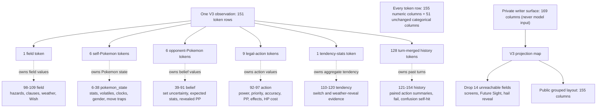

# Observation schema v3 — spec

Status: 2026-07-20, owner-approved direction for the next generation run.
Successor to `pokezero.observation.v2.2`. Additions motivated by the
Toxic redundant-clicking investigation and the sleep-clause / stall-loop
interpretability goals. **Design decision (owner question resolved): the fail
event and the clause state are SEPARATE signals** — `-fail` is a history marker
on the action's transition token and fires for many unrelated reasons (status
move on an already-statused target, Safeguard, clause blocks, …); the clause
bits are predictive current-state on the field token. Conflating them would make
the fail marker wrong for most fails and would break counterfactual
flag-flip probes. The model learns the correlation itself.

**v3 is still PRE-FREEZE** (the freeze gate is the input-audit program; the Rust
fold mirror + golden-corpus regeneration have not happened yet), so its layout
was reorganized in place before any checkpoint trained on it. V2/v2.1/v2.2 keep
their frozen positions and remain byte-identical. V3 removes the 14
evidence-backed dead numeric columns listed in [dead observation
fields](dead_observation_fields.md), groups the remaining semantic surface, and
has **155 numeric / 51 categorical** features. The map exported by
`showdown.py` is the physical-layout authority; historical `NUMERIC_*` writer
offsets below are not physical V3 positions.

## Change 1 — `-fail` transition event (corrective signal)

- `transitions.py`: on a `|-fail|…` protocol line while an action transition
  is in flight (`current is not None`), set `current.fail = True`. Scope to
  the action window and do NOT condition on which slot the argument names —
  the engine sometimes names the actor, sometimes the target, depending on
  the effect. (The existing `-miss` handler's actor-side condition is correct
  for misses; fails need the window-scoped rule.)
- Emission: mirror `miss`'s emission convention exactly (same feature class,
  adjacent position) on the action transition token, gated to schema >= v3.
- Under v2.2 emission the bit must not exist: **v2.2 output stays
  byte-identical.**
- Note: `-miss` is already encoded (since the v2.1/v2.2 batches). After v3,
  a silent no-op is disambiguated: miss bit = accuracy miss, fail bit =
  move failed, neither = genuinely event-less resolution.

## Change 2 — sleep-clause state bits (predictive signal)

Gen3 randbats runs the gen3 `Standard` ruleset: **Sleep Clause Mod is active;
Freeze Clause Mod is NOT** (it exists only in `standarddraft`) — no freeze
flag, it would be a dead column.

- Two numeric 0/1 features on the FIELD token, schema >= v3 only:
  - `sleep_clause_blocks_self`: an opposing pokemon is currently asleep from
    a sleep OUR side induced → our sleep-inducing moves will fail.
  - `sleep_clause_blocks_opp`: symmetric (feeds the opponent-action head).
- **Public attribution rule (no move-window bookkeeping needed):** in gen3
  singles, sleep is only ever (a) induced by the opposing side's move or
  (b) self-inflicted Rest, and Rest tags its status line
  (`|-status|SLOT|slp|[from] move: Rest`). Therefore: a `-status slp` line
  WITHOUT the Rest tag ⇒ induced by the opposing side. Track, per side, the
  set of enemy slots it has publicly put to sleep.
- Clear a tracked victim when it wakes (`-curestatus … slp`) or faints.
  Switching out does NOT clear (sleep persists and is public on revealed
  mons). Natural Cure ambiguity resolves via the same `-curestatus` line the
  belief engine already consumes.
- Anti-leakage: derived ONLY from public protocol lines — no engine-side
  hidden state. Both bits are computable by either player from the log.

## Change 3 — consecutive-stall counter (Protect/Detect/Endure)

Motivated by the stall-loop interpretability goal: Protect/Detect/Endure lose
success probability with each consecutive use, so a policy that cannot see its
own stall streak double-clicks Protect into a coin-flip. One numeric feature
exposes the streak so the model can price the falling odds.

**Engine ground truth (verified before coding, vendored showdown
`data/conditions.ts:439-462`, the `stall` condition — "Protect, Detect, Endure
counter"):** a stall move adds the `stall` volatile; `onStart` sets
`effectState.counter = 3`; every subsequent consecutive stall runs `onStallMove`
= `success = this.randomChance(1, counter)`, and **`if (!success) delete
pokemon.volatiles['stall']`** — a failed stall deletes the volatile, so the
counter resets to its `onStart` value on the next stall. `onRestart` does
`counter *= 3` (bounded by `counterMax: 729`) on each success. The volatile also
evaporates (duration 2, reset to 2 only by `onRestart`) after a non-stall turn,
and all volatiles clear on switch/faint. So the engine's counter is exactly a
**consecutive-successful-stall streak**, reset by a failed stall, a non-stall
action, a switch-out, or a faint. Gen3 shares this ONE `stall` volatile across
Protect, Detect and Endure (all three set `stallingMove: true` and call
`addVolatile('stall')`; `data/moves.ts` protect 13960 / detect 3523 / endure
4802). Pool reachability in `data/random-battles/gen3/sets.json`: Protect (43
species) and Endure (4 species) are reachable; Detect is NOT in the gen3
randbats pool (0 species) but shares the `protect` volatile and is handled for
correctness.

**Public reconstruction (no hidden state).** One per-side counter tracks the
consecutive successful stall-move uses by that side's currently-active mon:

- **Increment** on the success-only `-singleturn` tag. Two tag shapes, both
  verified in the vendored data: Protect/Detect share `volatileStatus:
  'protect'` and emit `|-singleturn|SLOT|Protect` (`data/moves.ts:13980`);
  Endure emits `|-singleturn|SLOT|move: Endure` (`data/moves.ts:4822`). These
  `-singleturn` lines fire ONLY on success — a failed stall emits `-fail` and no
  `-singleturn`. Other `-singleturn` users (Focus Punch, Magic Coat, Snatch)
  normalize to other names and are excluded.
- **Reset to 0** on any of the five causes, mirroring the engine's volatile
  deletion: (1) the mon's action window containing a `-fail` for a stall move (a
  failed Protect/Detect/Endure — the `randomChance` miss that deletes the
  volatile); (2) any non-stall `|move|` by that mon; (3) `|cant|`; (4)
  switch-out / `|drag|`; (5) `|faint|`.
- Tracked in the same home as the sleep-clause tracker (`_ReplayParser` in
  `showdown.py`, snapshot-carried), the counter/snapshot shape mirroring
  `toxic_stage` exactly: a per-slot parser dict → `snapshot()` →
  `normalize_for_player` per-side scalar → written on the ACTIVE mon token.
  A tiny per-side "stall move in flight" flag (set on a stall `|move|`, consumed
  by its `-singleturn`/`-fail`) distinguishes reset cause (1) from an unrelated
  `-fail`; it is snapshot-carried too so a mid-window resume converges.

- **Encoding:** one new numeric feature on each side's ACTIVE pokemon token
  (like `NUMERIC_TOXIC_STAGE`), schema >= v3 only, value `min(1.0, count / 8.0)`.
  Derived only from public protocol lines, so both players compute both
  counters. Its public V3 position is 32 in the `pokemon_state` group; the
  private writer uses the historical appendix offset before projection. Under
  v2.2 the column does not exist — **v2.2 output stays byte-identical.**

## Change 4 — confusion turns-so-far (elapsed-duration signal)

Owner directive: encode it because it is REACHABLE — do not gate on low
incidence. The public V3 position is 33 in `pokemon_state`.

- One numeric feature on the CONFUSED (active) mon's token, schema >= v3 only:
  `confusion_turns` = `min(1, elapsed / 5)`, where `elapsed` is the number of
  turns the mon has been confused so far. The confusion PRESENCE is already the
  `volatile:confusion` categorical (`TRACKED_VOLATILES`); this is the
  turns-so-far counter ONLY (the elapsed clock the presence bit cannot express).
- **Gen3 mechanic:** confusion duration is `this.random(2,6)` → `{2,3,4,5}`,
  max **5** (there is no gen3 duration override), so `CAP = 5` and the ramp
  saturates at `1.0`. The raw counter is left uncapped in the parser — a mon
  that is asleep while confused can dwell past 5 real turns without the hidden
  move-attempt clock ticking — and the encode's `min(1, …)` caps the value.
- **Reachability:** the ONLY pool source of confusion in gen3 randbats is Signal
  Beam's 10% secondary (ariados / venomoth / yanma). Rampage moves
  (outrage / thrash / petaldance) are NOT in the pool, so there is no
  rampage self-confuse source. Confusion is reachable; the column is not dead.
- **Public trace / attribution (no hidden state):** `|-start|SLOT|confusion` on
  application, `|-activate|SLOT|confusion` each confused turn, `|-end|SLOT|
  confusion` on snap-out. Elapsed (turns-so-far) is public; the remaining
  duration is hidden. The `_ReplayParser` per-slot counter advances by 1 on each
  `|turn|` while the `confusion` volatile is publicly present on that slot (the
  same per-`|turn|` advance the `toxic_stage` ramp uses), and RESETS to 0 on
  `-end confusion`, switch-out, or faint. Baton Pass copies the confusion
  volatile, so the reset is gated on the volatile being absent after the switch —
  a BP that carried confusion keeps the counter running on the inheritor.
- Under v2.2 emission the column does not exist: **v2.2 output stays
  byte-identical.** V3 carries it through the grouped layout while every legacy
  mode stays byte-frozen.

## Change 5 — encore turns-so-far (elapsed-duration signal)

Sibling of Change 4: the same per-slot elapsed-duration counter, applied to the
`encore` volatile. Encore locks the target into repeating its last move for the
duration, so a policy that cannot see how long the lock has run cannot price when
it is about to break. The public V3 position is 34 in `pokemon_state`.

- One numeric feature on the ENCORED (active) mon's token, schema >= v3 only:
  `encore_turns` = `min(1, elapsed / 6)`, where `elapsed` is the number of turns
  the mon has been encored so far. The encore PRESENCE is already the
  `volatile:encore` categorical (`TRACKED_VOLATILES`); this is the turns-so-far
  counter ONLY (the elapsed clock the presence bit cannot express).
- **Gen3 mechanic (verified before coding, vendored gen3 mod
  `data/mods/gen3/moves.ts` `encore.condition.durationCallback`):**
  `return this.random(3, 7)` → `{3,4,5,6}`, max **6** (the gen3 override; base
  Showdown's `duration: 3` is replaced), so `CAP = 6` and the ramp saturates at
  `1.0`. The raw counter is left uncapped in the parser — mirroring the
  confusion/toxic ramps — and the encode's `min(1, …)` caps the value.
- **Reachability:** Encore is a reachable gen3-randbats move. Pool count from
  `data/random-battles/gen3/sets.json`: **16 carriers**, so the column is not
  dead.
- **Public trace / attribution (no hidden state):** `|-start|SLOT|Encore` on
  application (vendored `encore.condition.onStart` → `this.add('-start', target,
  'Encore')`), `|-end|SLOT|Encore` on expiry (`onEnd` → `this.add('-end',
  target, 'Encore')`). Elapsed (turns-so-far) is public — count decisions since
  the `-start` — while the remaining duration is hidden. The `_ReplayParser`
  per-slot counter advances by 1 on each `|turn|` while the `encore` volatile is
  publicly present on that slot (the same per-`|turn|` advance the `toxic_stage`
  ramp and Change 4 use), and RESETS to 0 on `-end Encore`, switch-out, `|drag|`,
  or faint. Encore is `noCopy: true` (not Baton-Pass-copied), so — unlike
  confusion — the volatile is always dropped on switch-out and the reset is
  unconditional there; the volatile-absence gate is kept parallel to Change 4 and
  is trivially satisfied.
- Under v2.2 emission the column does not exist: **v2.2 output stays
  byte-identical.** V3 carries it through the grouped layout while every legacy
  mode stays byte-frozen.

## Change 6 — Wrap (partial-trap) turns-so-far (elapsed-duration signal)

Sibling of Changes 4/5: the same per-slot elapsed-duration counter, applied to
the `partiallytrapped` volatile that Gen 3 binding moves inflict. Wrap is the
gen3-randbats pool's ONLY partial-trap move and is central to Shuckle's
pin-and-stall line — it pins the target (no switching) while chipping it 1/16 a
turn, so a policy that cannot see how many turns the pin has already run cannot
price how many chip turns remain before the target breaks free. Its public V3
position is 35 in `pokemon_state`.

- One numeric feature on the TRAPPED (active) mon's token, schema >= v3 only:
  `wrap_trap_turns` = `min(1, elapsed / 5)`, where `elapsed` is the number of
  turns the mon has been partially trapped so far. The trap PRESENCE is already
  the `volatile:partiallytrapped` categorical (`TRACKED_VOLATILES`); this is the
  turns-so-far counter ONLY (the elapsed clock the presence bit cannot express).
- **Gen3 mechanic (verified before coding — the base condition's `duration` is
  the MODERN value and is WRONG for gen3):** the vendored base
  `data/conditions.ts` `partiallytrapped` declares `duration: 5` with
  `durationCallback → this.random(5, 7)` = `{5,6}`, which is the Gen 5+ binding
  duration; **the gen3 mod does NOT override it** (no `partiallytrapped` entry in
  `data/mods/gen3/conditions.ts`, and no partial-trap move overrides its
  `condition` in `data/mods/gen3/moves.ts`), so the sim would inherit the modern
  value — but the authoritative Gen II–IV binding-move mechanic is **2–5 turns**,
  max **5**. `poke-engine` corroborates that the duration is not an engine fact:
  it models the trap as a boolean `PokemonVolatileStatus::PARTIALLYTRAPPED` with a
  flat `maxhp / 16` end-of-turn residual (`src/gen3/generate_instructions.rs`) and
  **NO duration counter** — the volatile is a set membership, cleared on
  switch-out, never counted down. So the turn count is unavailable from either
  engine and MUST come from the PROTOCOL/parser (the public residual/`-end`
  cadence). We therefore take `CAP = 5` (the gen3 max), so the ramp saturates at
  `1.0` at the longest possible pin. The raw counter is left uncapped in the
  parser — mirroring the confusion/encore/toxic ramps — and the encode's
  `min(1, …)` caps the value. (Unlike confusion/encore, whose hidden
  move-attempt clock only ticks when the mon actually acts, the partial-trap
  residual fires every end-of-turn regardless of the trapped mon's action, so the
  raw counter tracks true elapsed and the cap is purely a saturation/safety
  bound.)
- **Reachability:** Wrap is the pool's SOLE partial-trap move, carried by exactly
  **one** species — Shuckle (from `data/random-battles/gen3/sets.json`, 1 of 220
  pool species). The column is reachable (it is the Shuckle pin automaton's
  signal) and is encoded per the owner directive (do NOT gate on incidence).
- **Public trace / attribution (no hidden state):** the sim never emits a
  `-start` for partial traps; application is
  `|-activate|SLOT|move: Wrap|[of] SOURCE` (base `partiallytrapped.onStart`), the
  per-turn residual is `|-damage|SLOT|…|[from] Wrap`, and expiry is
  `|-end|SLOT|Wrap|[partiallytrapped]` (`onEnd`) — note the `-end` carries the
  move NAME (`Wrap`), not the volatile id, exactly as the existing
  `_update_volatiles` partial-trap arm already handles it. Wrap traps the TARGET
  (the target cannot switch and takes chip); elapsed (turns-so-far) is public —
  count decisions since the `-activate` — while the remaining duration is hidden.
  The `_ReplayParser` per-slot counter advances by 1 on each `|turn|` while the
  `partiallytrapped` volatile is publicly present on that slot (the same
  per-`|turn|` advance the `toxic_stage` ramp and Changes 4/5 use), and RESETS to
  0 on `-end <partial-trap move> [partiallytrapped]`, switch-out, `|drag|`
  (phazing), or faint. Unlike Encore, `partiallytrapped` IS a Baton-Pass-copied
  volatile (`_BATON_PASS_TRANSFERRED_VOLATILES`), so — as with confusion — the
  switch reset is gated on the volatile being absent from the finalized slot set:
  a plain switch/drag drops the volatile (reset), while a Baton Pass that carried
  the trap keeps the counter running on the inheritor. (In gen3 the vendored sim
  also emits a silent `-end` when the TRAPPER leaves the field; the counter
  follows the public `-end` either way, so it never needs to model the trapper's
  seat.)
- Under v2.2 emission the column does not exist: **v2.2 output stays
  byte-identical.** V3 carries it through the grouped layout while every legacy
  mode stays byte-frozen.

## Change 7 — per-mon gender (static public attribute)

Gender is a public fact that was never encoded, yet the search engine already
conditions on it (Cute Charm infatuation; pool carriers Clefable / Wigglytuff /
Delcatty). The Layer-3 collision audit flagged this as a policy/search asymmetry:
the value function sees a coupling the policy is blind to. This change closes it.
(This is a STATIC per-mon attribute — no `_ReplayParser` counter — at physical
V3 positions 36 and 37 in `pokemon_state`.)

- Two 0/1 numeric features on EVERY mon token (self and opponent), schema >= v3
  only: `gender_male` at V3 position 36 and `gender_female` at V3 position 37.
  Male → `(1, 0)`, female → `(0, 1)`, genderless → `(0, 0)`
  (a two-bit one-hot with an all-zero "genderless/unknown" class — no third
  column needed).
- **Source (public only):** SELF gender comes from the request/known set
  (`candidate.details`); OPPONENT gender from the `details` string Showdown emits
  on switch-in (`|switch|SLOT|Species, Lxx, M|…`). Both are parsed by the
  EXISTING `determinization._gender_from_details`, which reads the `, M` / `, F`
  token (genderless mons carry no gender letter). Reused verbatim (single source
  of truth for the details convention), imported lazily in the encoder to avoid a
  module-load cycle.
- **Opponent pre-reveal = `(0, 0)`:** an opponent mon that has not yet been seen
  is not in the revealed team, so its token carries no gender bits; the bits
  appear the moment the switch-in `details` reveal lands. Transform does NOT
  change gender, so a transformed Ditto keeps its own sex (the bits read
  `candidate.details`, not the copied identity).
- Under v2.2 emission the columns do not exist: **v2.2 output stays
  byte-identical.** V3 carries them in `pokemon_state` while every legacy mode
  stays byte-frozen.

## Change 8 — Mean Look / Spider Web move-trap

The switch-lock from Mean Look (Misdreavus) and Spider Web (Ariados) is public
and decision-critical (it is what makes a perish-trap or a slow sweep work), yet
it had no encoding. It is a DISTINCT mechanic from the Wrap partial-trap (Change
6): Wrap pins *and* chips 1/16 a turn via the `partiallytrapped` volatile, while
Mean Look pins with no residual via the `trapped` volatile — and distinct again
from the trap-ability signal (`NUMERIC_TRAPPER_ALIVE`, Shadow Tag / Arena Trap /
Magnet Pull), whose encoder shape this bit mirrors. Its physical V3 position is
38 in `pokemon_state`.

- One 0/1 numeric feature on the TRAPPED (active) mon's token, schema >= v3 only:
  `meanlook_trap` at V3 position 38 = "this mon is switch-locked by an opposing
  Mean Look / Spider Web."
- **Gen3 mechanic (verified against the vendored data + poke-engine):** both
  moves run `target.addVolatile('trapped', source, move, 'trapper')`
  (`data/moves.ts`; the gen3 mod does not override them). The base
  `data/conditions.ts` `trapped` volatile is `noCopy` (never Baton-Pass-copied),
  has an `onStart` that emits `|-activate|SLOT|trapped` (the volatile id, no
  `[of]`, no move prefix), and has **NO `onEnd`** — so no protocol line marks the
  trap's end. It is linked to the source's `trapper` volatile: when the trapper
  leaves the field, `removeLinkedVolatiles` drops the target's `trapped`
  **silently**. `poke-engine` does not model move-traps at all — its gen3
  `trapped()` (`src/gen3/state.rs`) covers only LockedMove, `partiallytrapped`,
  and the trap ABILITIES — so, like the partial-trap counter, this signal is
  available ONLY from the protocol.
- **End conditions (gen3, handled in the parser):** the trap ends when (a) the
  TRAPPED mon leaves its slot (switch / `|drag|` / faint), or (b) the TRAPPER
  leaves its slot (switch / `|drag|` / faint of the opposing active mon — the
  linked source-side volatile is what actually drops the trap). The
  `_ReplayParser` SETS `meanlook_trap[SLOT]` on `|-activate|SLOT|trapped` and
  clears BOTH seats on any switch/drag (parse loop) or `|faint|` — in singles the
  trapper is always the opposing active mon, so the two-seat clear is exact.
  `|-activate|SLOT|trapped` is emitted ONLY by move-traps (ability traps trap at
  request time via `onFoeTrapPokemon` with no protocol line), keeping this bit
  cleanly separated from `NUMERIC_TRAPPER_ALIVE`.
- **Reachability:** Mean Look (Misdreavus, "Staller" set) and Spider Web (Ariados,
  "Bulky Support" / "Bulky Setup" sets) in `data/random-battles/gen3/sets.json`.
- Under v2.2 emission the column does not exist: **v2.2 output stays
  byte-identical**; V3 carries it in `pokemon_state`.

## Change 9 — Wish turns-to-land (per-side pending-heal clock)

The v2.2 schema already exposes a per-side **pending-Wish boolean** on the field
token (`NUMERIC_SELF_WISH_PENDING` = 56, `NUMERIC_OPP_WISH_PENDING` = 57): "a
Wish is queued to heal this side's slot." That bit says *whether* a Wish is
in flight but not *when* it lands, and the two are decision-distinct — "the heal
arrives THIS end-of-turn" licences a sacrificial pivot or an all-out attack that
"the heal arrives NEXT turn" does not. This change adds the **turns-to-land
clock** as the sibling of the confusion/encore/Wrap elapsed counters (Changes
4/5/6), but expressed as turns REMAINING rather than elapsed, and on the field
token per side (like the sleep-clause pair, Change 2) rather than on a mon token
— because a Wish is a **per-SIDE slot condition**, not a per-mon volatile. The
public V3 positions are 108 and 109 in `field`.

- Two numeric features on the FIELD token, schema >= v3 only, on the SAME token as
  the v2.2 pending bits:
  - `self_wish_turns` at V3 position 108 = `min(1, remaining / 2)`.
  - `opp_wish_turns` at V3 position 109 = the symmetric per-side value.

  where `remaining = 2 - (turn - set_turn)` is the number of turns until the Wish
  resolves: **2** on the turn it is declared (`set_turn`), **1** on the turn it
  lands (end of `set_turn + 1`), and 0 (column empty) otherwise. So the column
  reads `2/2` then `1/2` across a Wish's life and returns to 0 the moment it
  lands (or when no Wish is pending). This is the SAME `wish_set_turns` tracker
  the v2.2 pending bit already reads (`_update_wish` in `showdown.py`), re-derived
  as a remaining-turns clock; it is nonzero on **exactly** the turns the pending
  bit is set, so the two never disagree about presence.
- **Gen3 mechanic (verified — the heal is RECIPIENT-based, no engine change):**
  gen3 Wish is a `slotCondition: 'Wish'` with `duration: 2` that resolves at
  residual order 7 and heals the RESOLVING active mon's `baseMaxhp / 2`. It is a
  **per-side slot** condition: the heal lands on whatever mon occupies the slot
  when it resolves (the "wish-pass" play), scaled to THAT mon's max HP. The
  engine and the observation materialization are already gen3-correct on the heal
  amount (`poke-engine` heals the recipient's half-max), so this change adds NO
  heal-amount column — the landed heal is `½ × the recipient's max HP`, already
  derivable from that mon's max-HP columns (redundant to encode). The **caster's**
  max-HP rule is Gen 5+ and is deliberately NOT modelled.
- **Per-slot, so it survives a wish-pass switch.** `wish_set_turns` is keyed on
  the SIDE (`p1` / `p2`), not the mon, so the clock persists across a switch
  within the slot: the mon that Wished can pivot out and the incoming mon reads
  `self_wish_turns = 1/2` ("the heal lands on ME this turn"). This is the same
  per-slot semantics the v2.2 pending bit already has.
- **Reachability:** the Wish move is carried by **16** species in the
  gen3-randbats pool (`data/random-battles/gen3/sets.json`): Blissey, Jirachi,
  Vaporeon, Umbreon, Kangaskhan, Togetic, Delcatty, Flareon, Girafarig, Hypno,
  Lickitung, Minun, Plusle, Spinda, Wigglytuff, Xatu. The column is reachable
  and encoded per the owner directive (do NOT gate on incidence).
- **Public trace / attribution (no hidden state):** SET on the `|move|SLOT|Wish`
  declaration (`wish_set_turns[side] = turn`; a re-declared Wish while one is
  already pending FAILS in gen3 and does NOT re-arm), CLEARED when the heal lands
  (`|-heal|SLOT|…|[from] move: Wish` on the slot occupant, end of the next turn).
  Both are public protocol lines readable by either player, so both sides compute
  both clocks. Derived ONLY from the public log — no belief-engine state — so this
  column is gated on the schema alone (not on `masks.exact_state`, which darkens
  the belief-fed exact-state layer where the v2.2 pending BIT lives). The v2.2
  pending bits (56/57) are left byte-identical.
- Under v2.2 emission the columns do not exist: **v2.2 output stays
  byte-identical.** V3 carries them in `field` while every legacy mode stays
  byte-frozen.

### Belief residual-tag fix (Wish landing heal; #769 pinch-berry class)

A separate correctness fix that ships with this change (belief layer, not the
observation schema). Wish's landing heal `|-heal|SLOT|…|[from] move: Wish` is an
END-OF-TURN RESIDUAL heal and, exactly like the Leftovers / Rain Dish residual
heals already in `belief._RESIDUAL_HP_TAGS`, it must NOT overwrite the
action-phase HP snapshot (`_hp_after_actions`, gated by
`_is_action_phase_hp_change`) that the non-proc item pruning reads. This is the
same mechanism #769 fixed for the Toxic / burn residual DAMAGE tags. Before the
fix, a Wish landing on a mon that had already fallen to ≤25% during the action
phase (with no pinch-berry activation) would overwrite the low pre-residual
snapshot with the healed value, MASKING the action-phase non-proc so the pinch
variants were left un-pruned; adding `[from] move: Wish` to the residual-tag
list restores the correct pruning (the snapshot keeps the true action-phase HP,
so a genuine ≤25% non-proc still rules the pinch variants out even when a Wish
heal follows in the residual phase) and cannot let a residual Wish heal corrupt
the pinch-berry (or Leftovers) reasoning. **Ingrain is deliberately NOT added**
— it has 0 gen3-randbats pool carriers (unreachable).

## Change 10 — confusion self-hit damage-attribution correction (corrective signal)

When a **confused** mon self-hits (gen3: a 50% roll each turn it acts; confusion
is reachable in the pool via Signal Beam's 10% secondary), the sim emits
`|-activate|SLOT|confusion` then an **UNTAGGED** `|-damage|SLOT|…` with **no
intervening `|move|`/`|cant|` line** — the confused mon's turn is spent hurting
itself. When the confused mon is the **SLOWER** of the two, that untagged
self-damage lands while the FASTER opponent's move window is still open, and the
fold — correctly, for the `damage_fraction` field the v2.2 encode reads — folds
it into the opponent's move `damage_fraction`. The opponent's move token then
overstates its own damage by the self-hit amount (e.g. a 0.17 Surf reads 0.27
after a 0.10 self-hit folds in), polluting damage calibration.

This change corrects the attribution **at encode time under v3 only**, without
touching the folded `damage_fraction` field:

- **Extraction (schema-agnostic, both fold paths).** The fold latches the slot on
  `|-activate|X|confusion` (`pending_confusion_selfhit_slot`), and when the NEXT
  `-damage` is the untagged self-hit on that slot, records its own fraction into a
  new additive `confusion_selfhit_fraction` field on the move window it was folded
  into — **in addition to** the existing (unchanged) `damage_fraction += delta` —
  plus a companion `confusion_selfhit` presence flag. The latch is armed only by
  `|-activate|X|confusion` and disarmed by the next action (a real move clears it,
  so a confused mon that shakes off confusion and attacks is unaffected) or the
  next `-damage` (a non-self hit clears without recording; a `[from] confusion`
  TAGGED self-hit never folds into `damage_fraction` in the first place, so it is
  neither corrected nor flagged). These fields ride the per-action `TransitionToken`
  and the turn-merged `TurnSubBlock` and survive the merge/flatten bijection.
- **v3 encode (schema >= v3 only).** For the move sub-block whose damage absorbed
  the self-hit, the encode writes the damage-fraction column as
  `damage_fraction - confusion_selfhit_fraction` (the move's OWN damage, self-hit
  removed) and sets `NUMERIC_TT_CONFUSION_SELFHIT` at V3 position 154 = 1.0.
  Semantics: "the defender self-hit from confusion after this move." It is a SINGLE
  history column (not a first/second pair like the `-fail` bit) because the correction
  always rides the FIRST sub-block in practice — the confused mon must be SLOWER, so
  the opponent moved first; the write is mirrored onto the second sub-block defensively.
  **No new token is synthesized** (that would change the turn-merged stream length/order
  and break v2.2 byte-identity).
- **v2.2 stays FROZEN (explicit).** Change 10 is a V3-only rewrite of the carried
  `NUMERIC_TT_DAMAGE_FRACTION` semantic field. **The
  v2.2 encode deliberately RETAINS the folded value (0.27 in the example) — the
  live m50/l200 runs keep exactly the value they were trained on.** The v2.2 path
  never reads `confusion_selfhit_fraction`/`confusion_selfhit` and computes the
  damage column from the unchanged `damage_fraction`, so v2.2 output is byte-
  identical to the pre-change encoder by construction (verified: a v2.2-vs-pristine
  SHA over a confusion-self-hit-both-seats + normal-game battery is identical). The
  V3 map carries every applicable v2.2 semantic field except this intentionally
  corrected value and the documented dead-column drops.
- **Reachability:** confusion is a reachable volatile (Signal Beam 10% in the pool;
  the confusion self-hit is a 50% roll). Encoded per the owner directive (encode
  reachable, do NOT gate on incidence).

## Schema plumbing

- New id `pokezero.observation.v3`, CLI choice `v3`, and a fixed **155 numeric /
  51 categorical** census. V2/v2.1/v2.2 specs, count maps, checkpoint latching,
  and direct encoder writes remain unchanged.
- V3 allocates a private 169-column writer row so existing named writers
  can remain shared with frozen V2.x code. `_project_v3_numeric_rows` performs the
  sole V3-only layout projection after every token writer completes.
- `V3_NUMERIC_LEGACY_INDEX_BY_NEW_INDEX` is the ordered physical V3 map;
  `V3_NUMERIC_INDEX_BY_LEGACY_INDEX` is its inverse. `v3_numeric_index()` maps a
  historical writer constant specifically for V3; cross-schema consumers use
  `numeric_index_for_schema()`. A public-tensor consumer must never index with a
  `NUMERIC_*` writer constant directly. The layout table is exported as
  `V3_NUMERIC_LAYOUT_GROUPS`.
- The map accounts for every private legacy writer column: 155 are carried, 14
  are explicitly dropped under the reachability evidence in
  [dead observation fields](dead_observation_fields.md), and two carried semantic
  fields (`NUMERIC_TT_DAMAGE_FRACTION` and `NUMERIC_TM2_DAMAGE_FRACTION`) are
  deliberately rewritten for the confusion-self-hit repair.
- No categorical vocabulary rows change. In particular, `cant:confusion` is
  never emitted (a confusion self-hit produces no `|cant|` line), and extending
  the globally sorted categorical vocabulary would shift V2.2 rows. The
  categorical surface remains checkpoint-compatible by design.
- The Wish residual-tag change (`[from] move: Wish` in
  `belief._RESIDUAL_HP_TAGS`) remains a belief-layer repair, not a schema column.

## Acceptance (tests required)

1. Scripted protocol with a failed status move → fail bit set on that action
   transition under v3; absent under v2.2; v2.2 encoding of the same log is
   byte-identical to before the change.
2. Clause lifecycle, both directions: induced sleep → bit on; Rest → bit
   stays off; `-curestatus slp` → bit off; faint of the sleeper → bit off;
   switch-out of the sleeper → bit stays on.
3. Stall-counter lifecycle: the column rises 1/8, 2/8, … on consecutive
   Protects and resets to 0 on EACH of the five causes (failed stall `-fail`,
   non-stall move, `cant`, switch-out/drag, faint); Endure shares the counter;
   opponent side symmetric, both seats; snapshot round-trip preserves both
   counters; the v3 column position is pinned; a Protect-heavy log's v2.2
   encoding is byte-identical to before the change.
4. Confusion turns-so-far (change 4): a scripted Signal-Beam-confusion game
   raises the confused mon's `confusion_turns` column 1/5, 2/5, … under v3, and
   it resets to 0 on `-end confusion`, switch-out, and faint; the same log's
   v2.2 encoding is byte-identical to before the change (the column does not
   exist under v2.2); snapshot round-trip preserves the elapsed counter.
5. Encore turns-so-far (change 5): a scripted Encore game raises the encored
   mon's `encore_turns` column 1/6, 2/6, … under v3, and it resets to 0 on
   `-end Encore`, switch-out, `|drag|`, and faint; the same log's v2.2 encoding
   is byte-identical to before the change (the column does not exist under v2.2);
   snapshot round-trip preserves the elapsed counter.
6. Wrap partial-trap turns-so-far (change 6): a scripted Shuckle-Wrap game raises
   the trapped mon's `wrap_trap_turns` column 1/5, 2/5, … under v3, and it resets
   to 0 on `-end Wrap [partiallytrapped]`, switch-out, `|drag|`, and faint; the
   same log's v2.2 encoding is byte-identical to before the change (the column
   does not exist under v2.2); snapshot round-trip preserves the elapsed counter.
7. Gender (change 7): a male mon encodes `(1, 0)`, a female mon `(0, 1)`, and a
   genderless mon `(0, 0)` on both the self and opponent tokens under v3; an
   opponent mon is `(0, 0)` before it is revealed and flips on the switch-in
   reveal; the same log's v2.2 encoding is byte-identical to before the change
   (the columns do not exist under v2.2).
8. Mean Look / Spider Web move-trap (change 8): a scripted Mean Look (or Spider
   Web) game sets the trapped mon's `meanlook_trap` bit under v3 on `-activate
   trapped`, and clears it when the trapper switches out, the trapped mon leaves,
   or either faints; the bit is DISTINCT from the Wrap partial-trap column and the
   trap-ability signal; the same log's v2.2 encoding is byte-identical to before
   the change (the column does not exist under v2.2); snapshot round-trip
   preserves the flag.
9. Wish turns-to-land (change 9): a scripted Wish game raises the wishing side's
   `wish_turns` column on the field token to `2/2` on the declaration turn and
   `1/2` on the landing turn under v3, and it returns to 0 the turn the Wish lands
   (and stays 0 when no Wish is pending); both seats symmetric; a wish-pass switch
   (the wisher pivots out before the Wish resolves) keeps the clock on the side so
   the incoming mon reads `1/2`; the same log's v2.2 encoding is byte-identical to
   before the change (the columns do not exist under v2.2) and the v2.2 pending
   bits 56/57 are unchanged. Belief residual-tag: a Wish landing on a mon that
   fell to ≤25% during the action phase (no berry eaten) still rules the pinch
   variants out — the residual Wish heal does not mask the action-phase non-proc
   (mirrors the #769 pinch-berry class).
10. Confusion self-hit (change 10): a scripted game where the SLOWER confused mon
    self-hits with an untagged `-damage` (no `|move|`/`|cant|` line) has the
    opponent's move token read the FOLDED damage (0.27) under v2.2 and the
    CORRECTED damage (0.17) plus `NUMERIC_TT_CONFUSION_SELFHIT = 1` under v3; the
    fold records `confusion_selfhit_fraction`/`confusion_selfhit` on both fold
    paths and they survive the merge/flatten bijection; a `[from] confusion`
    tagged self-hit and a confused-mon-that-still-moves engage neither field; the
    v2.2 encoding is byte-identical to before the change (cmp-against-pristine SHA
    over a both-seats + normal-game battery), and the change fails without the fix
    (pristine v3 reads 0.27).
11. The raw V3 output has exactly 155 numeric columns. A synthetic projection
    and a real V2.2/V3 encode assert every carried semantic field satisfies
    `v3[v3_numeric_index(old)] == v2_2[old]`, except the documented first- and
    second-sub-block confusion-self-hit rewrites. Every dead legacy index raises from
    `v3_numeric_index`; categorical rows, masks, and token types remain shared.
12. Existing V2.2 test suites pass untouched.

## Numeric-column accounting

V3's public numeric order is semantic, not historical. Exact per-column source
positions live in `V3_NUMERIC_LAYOUT_GROUPS`; the table below is the stable
human-facing summary.

| V3 positions | Group | Contents |
| --- | --- | --- |
| 0–5 | `core` | HP fraction, active/legal/present, level, turn count |
| 6–38 | `pokemon_state` | base/boosted/actual stats, toxic/sleep/substitute/trapper state, Tier-2 pins, stall/confusion/Encore/Wrap clocks, gender, Mean Look |
| 39–91 | `belief` | candidate and reveal counts, opponent tendencies, expected stat ranges, revealed opponent PP and validity buckets |
| 92–97 | `action` | base power, priority, accuracy, PP, effect chance, self-HP cost |
| 98–109 | `field` | hazards, sleep clause, weather, pending Wish, V3 sleep-clause blocks, Wish clocks |
| 110–120 | `tendency` | global action tendencies and rain/sun/sand public weather-reveal pairs |
| 121–154 | `history` | first/second turn-merged action summaries, V3 fail bits, confusion-self-hit flag |

### Token-layout view

The dropped private legacy numeric indices are
`{24, 25, 35, 36, 48, 49, 50, 51, 52, 53, 54, 55, 103, 104}`: screen state and
timers, Future Sight, and the unreachable Gen3 hail reveal pair. Their evidence
and pool-change maintenance condition are recorded in
[dead observation fields](dead_observation_fields.md). The 155 carried
positions include all ten V3 additions above; their historical appendix offsets
are implementation-private and must not be used as physical V3 positions.

## Coordination (v3-stream / Rust fold)

The golden-corpus bit-exactness gate means this schema lands in BOTH
encoders: after this (production) implementation merges, the Rust fold
encoder (`rust/pokezero-search`) mirrors it and the golden corpus is
regenerated at v3. Until then the corpus stays on v2.2 and the gate is
unaffected (v2.2 output unchanged). The new generation run launches only
after both sides agree.

## Review dispositions (2026-07-20, post-implementation Opus review: SHIP)

- **Fail on switch rows is INTENDED.** A blocked switch-in Intimidate (Clear
  Body / Hyper Cutter / White Smoke) emits `-fail` inside the switch window,
  so a switch sub-block can carry `fail=True`. Kept deliberately: it is
  deterministic, public, disambiguated by the sub-block kind, and publicly
  reveals the opponent's ability class — informative signal, not noise.
- **Known accepted loss (v3-only, rare):** a Baton Pass completion switch is
  collapsed into `baton_pass_species` during turn-merging, dropping a
  `fail=True` from a BP-into-Clear-Body Intimidate block. To revisit at the
  Rust-mirror/corpus-regeneration milestone with a scenario test; either
  preserve fail onto the collapse or re-accept the loss explicitly.
- Golden-corpus tooling migrated to the schema-family membership tuple so a
  future default-schema bump cannot silently disable turn-merged capture.
