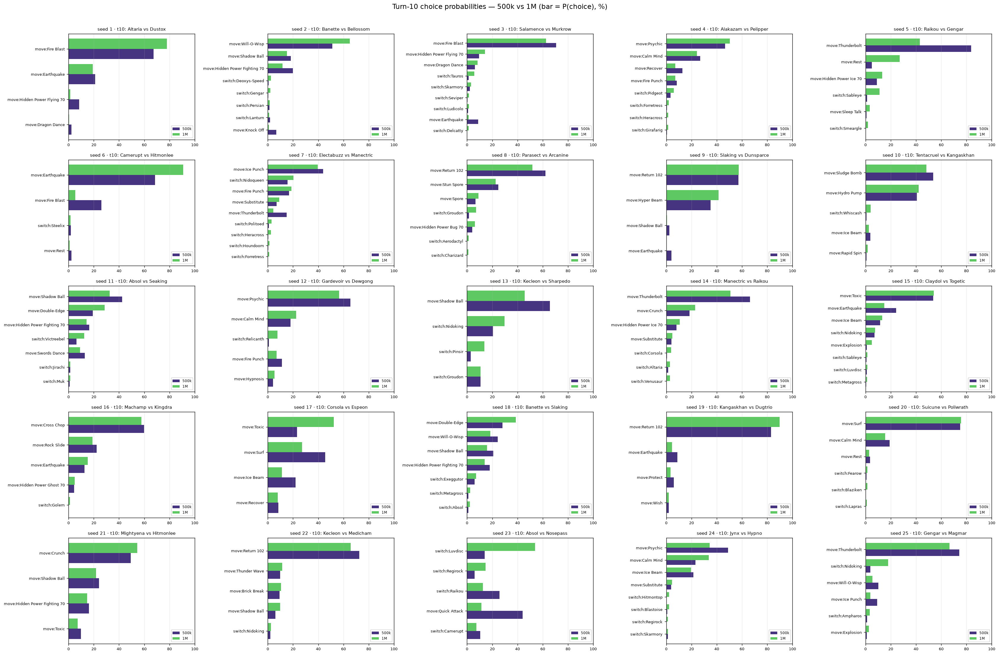

# Behavioral evals

Tools and committed fixtures for tracking **how a checkpoint plays** (not just its win-rate)
as training progresses. Win-rate says a model is stronger; these say *what changed in its
strategy*. Re-run on each new checkpoint and watch the trajectory of each factor.

All scoring uses single-frame action-probability readouts from the policy head
(`evaluate_transformer_action_priors`) on real decision states, so numbers are comparable
across checkpoints. States come from **fixed, checkpoint-independent heuristic drivers**
(max-damage / simple / random), so the eval set never shifts under the checkpoints being graded.

## `turn10_choice_sample.json` (committed)

Per-checkpoint probability of every legal choice on a fixed set of mid-game states — the
turn-10 decision from 25 unique games. A diffable behavioral fingerprint: when a new checkpoint
lands, append it and eyeball how the distributions moved. Regenerate with:

```sh
python scripts/choice_sample.py \
  --checkpoint checkpoints/pokezero-gen3-500k.pt=500k \
  --checkpoint checkpoints/pokezero-gen3-1m.pt=1M \
  --showdown-root <path-to-pokemon-showdown> \
  --out evals/turn10_choice_sample.json
```

The state set is deterministic in (seed_start, num_games, turn, driver ensemble), so re-running
reproduces the same states and only the checkpoint list changes.

Render it as a grouped bar chart (one panel per state, one bar per checkpoint per choice):

```sh
pip install -e '.[viz]'   # matplotlib
python scripts/plot_choice_sample.py --in evals/turn10_choice_sample.json --out evals/turn10_choice_sample.png
```



## `scripts/checkpoint_factors.py` — factor suite

Aggregate behavioral factors over a shared corpus of real decision states:

- **switch_propensity** — mean P(switch) where a switch is legal (rose ~0.14 → 0.19, 500k → 1M).
- **toxic_switch** — counterfactual: does P(switch) rise when the active mon is engineered badly
  poisoned (vs untouched), over healthy *poison-susceptible* mons only? ~0 ⇒ toxic-blind.
- **setup_usage** — probability mass on setup moves (Dragon Dance / Calm Mind / Swords Dance /
  Bulk Up) where legal, split by board pressure (healthy vs low-HP active) as an appropriateness
  signal — a strong policy sets up more when healthy than when pressured.

## `scripts/policy_probe.py` — single-factor counterfactual probe

Deep-dive on one engineered scenario: capture a real state for a poison-susceptible staller and
sweep the toxic counter (single-frame and as a climbing temporal history) to see whether the
policy's switch probability responds. Guards against engineering toxic onto Poison/Steel mons
(immune — an impossible state).
